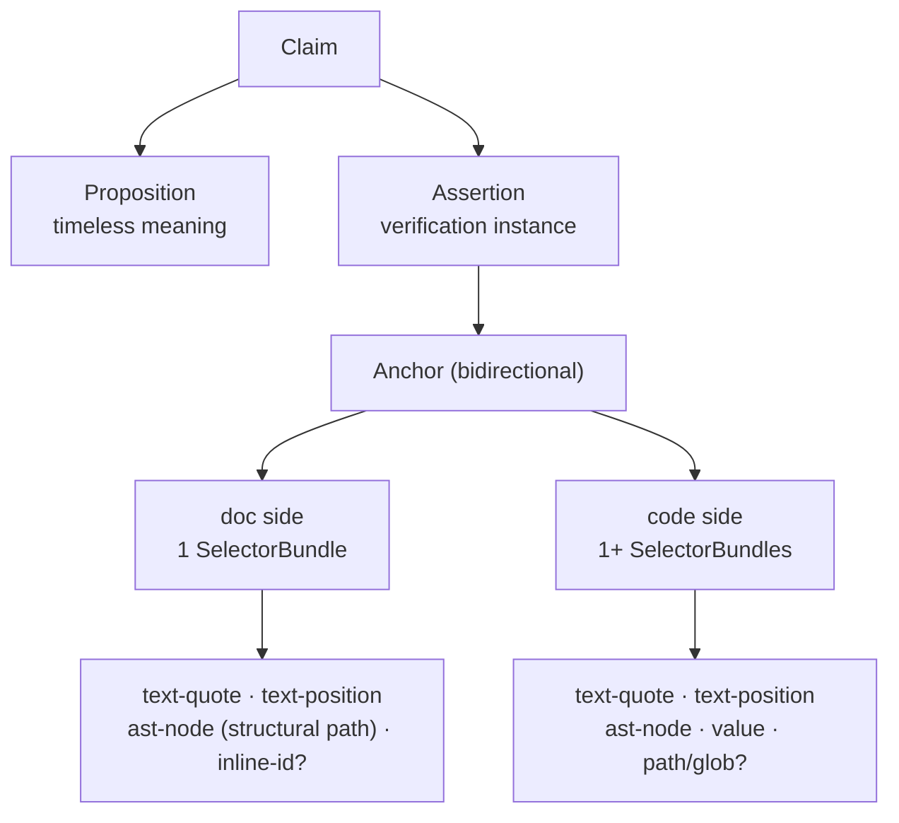

A **claim** is a sentence in a doc that asserts how your code behaves. To check
whether that sentence is still honest, Hibi has to find two things in your
current files: the **sentence** (did the prose change?) and the **code** it
describes (did the behavior move out from under it?). The thing that lets Hibi
find both, over and over, as the repo churns, is the **anchor**.

An anchor is a pair of pointers, not a copy of anything:

```
Anchor = { doc: SelectorBundle, code: SelectorBundle[] }
```

The **doc side** is the documented sentence, and it is the source of truth. The
**code side** is one or more bundles describing the code the sentence is about. A
claim can point at several places in the code (a function and the constant it
reads, say), so the code side is a list of bundles; the doc side is always a
single bundle.

<Note>
  The store holds the anchor, not the prose. The sentence Hibi recorded is kept
  only as anchoring material and an audit cache. At check time Hibi re-reads the
  live span from the document and works from that. The documented span is the
  source of truth, so a doc that has been reworded can't hide behind a
  stale copy in the store.
</Note>

## The bidirectional anchor

Each side of the anchor is a **SelectorBundle**: a single file plus a list of
**selectors**, each a different way of pointing at the same span. No one selector
survives every kind of edit, so Hibi records several and weighs how well they
agree.



*Each side bundles several redundant selectors. No single selector survives every
edit; agreement across them sets confidence.*

Two terms in that diagram are worth defining once. A **Proposition** is the
timeless meaning of the claim ("retries use exponential backoff"), independent of
where it lives. An **Assertion** is one instance of verifying that proposition in
a specific doc against specific code; it is the Assertion that carries the anchor.
One proposition can be asserted from more than one place.

## The six selector kinds

Selectors range from precise-but-brittle to coarse-but-durable. Hibi records the
ones that apply and fuses them; the durability and the cost differ, which is why
no single kind is enough.

| Selector | Side | What it pins | Survives | Notes |
|---|---|---|---|---|
| `text-quote` | both | the exact text plus a 48-character prefix and suffix | moves, small edits | Matched fuzzily (W3C TextQuoteSelector + Bitap). The base selector on both sides. |
| `text-position` | both | a line / character range | nothing, really | A cheap hint and a tie-breaker only, never a span's sole identity. |
| `ast-node` | both | the enclosing named syntax node | relocation, reformatting | On the code side, a code symbol (via tree-sitter). On the doc side, a markdown structural path. |
| `value` | code | an extracted literal value | everything except a value edit | So changing `MAX_ATTEMPTS = 5` to `50` trips the claim even when nothing else moved. Which AST kinds carry a literal is configured per grammar. |
| `inline-id` | doc (owned docs) | a hidden marker near the paragraph, e.g. `<!-- hibi:claim id=… -->` | edits around it | Optional. It identifies the record; it never restates the claim. If the marker and the prose disagree, the prose wins. |
| `path` / `glob` | code | a file, directory, or glob | renames within scope | Coarse coverage for navigation and blast-radius only. |

<Warning>
  Coarse anchors (a bare `path` or `glob`) are **never reported as stale**. They
  exist to answer "which claims touch this area?" and to size the blast radius of a
  change, not to grade drift. A claim backed only by a coarse anchor cannot gate.
</Warning>

## Why redundancy, not one perfect selector

No single signal is robust on its own. Positions drift on every edit above them,
quoted text breaks the moment someone reformats, and syntax nodes move when code is
restructured. If Hibi trusted any one of these alone, it would either miss real
drift or cry wolf on every cosmetic change.

Recording several selectors per side turns "did this match?" into "how much do my
selectors agree?" That agreement is what lets Hibi tell a harmless reformat (the
quote shifted but the syntax node and value are intact) from a meaningful change
(the value differs, or the node is gone), deterministically, with no model in the
check loop.

## Confidence fusion

When Hibi localizes a side, each selector that resolves contributes a similarity
score `s` between 0 and 1, weighted by how trustworthy that kind of selector is.
The bundle's confidence is the weighted average over the selectors that
resolved:

```
C = Σ(wᵢ · sᵢ) / Σ(wᵢ)
```

The weights:

| Selector | Weight `w` |
|---|---|
| `ast-node` | 0.35 |
| `text-quote` | 0.30 |
| `value` | 0.20 |
| `text-position` | 0.15 |

A few rules shape the outcome before the score becomes a state:

<AccordionGroup>
  <Accordion title="At least two selectors must resolve">
    Fewer than **two** resolved selectors and the side is `orphaned` at confidence
    0. A lone surviving selector is not corroboration (it could be a coincidental
    match), so Hibi refuses to grade on it. One exception: a single **near-exact
    `text-quote` match (similarity ≥ 0.9)** satisfies the minimum on its own —
    that is what lets a relocated prose sentence grade `moved` instead of
    `orphaned`. Quotes shorter than **8 characters** are too common to trust for
    multi-match detection and are ineligible for `ambiguous`.
  </Accordion>
  <Accordion title="Structural-only AST matches score 0.40">
    If the `ast-node` matches only structurally (same shape after a rename or a
    whitespace change, not an exact match), it scores `0.40` rather than a full
    hit. The construct is still there; the text around it shifted.
  </Accordion>
  <Accordion title="The value veto">
    If a `value` selector changed (score 0) **and** the `text-quote` similarity is
    at least `0.9`, Hibi forces the side to `changed` at confidence `0.3`. The
    prose still matches, but the literal it cites no longer does: the kind of
    silent change (`5 → 50`) the value selector exists to catch.
  </Accordion>
  <Accordion title="Fuzzy-matching parameters">
    The `text-quote` selector matches with a Bitap fuzzy search: `Match_Threshold`
    `0.4`, `Match_Distance` `100000`, with a 48-character context window on each
    side. These are fixed so the same tree always yields the same match.
  </Accordion>
</AccordionGroup>

The confidence `C` is then bucketed into an anchor-resolution state. The bands and
the move-awareness rule (an otherwise-`unchanged` hit that relocated by more than
4 characters is downgraded to `moved`) are graded the same way for both sides, and
the full mechanics live on the verdicts page.

<Card title="Confidence bands & states" icon="scale-balanced" href="/verdicts">
  How `C` becomes `unchanged` / `moved` / `changed` / `ambiguous` / `orphaned`,
  and how those roll up into an exit code.
</Card>

## Doc-first resolution

Hibi resolves the **doc** side first: it finds the sentence in
the current document and extracts the live claim text. Only then does it localize
the code side.

The reason is integrity. A claim whose source sentence has been deleted or
rewritten must not be verified against code as if the sentence still existed.
That would be checking a span that is no longer there. So if the doc side comes
back `changed` or `orphaned`, Hibi stops and reports that, rather than grading
stale prose against the code. The documented span is the source of truth, all the
way down.

## Precision tiers

Selectors live in a stack of tiers, from cheap text matching up to executable
checks. The first two tiers are what anchors and fusion cover:

<Steps>
  <Step title="Tier 1: text">
    Fuzzy `text-quote` localization plus normalized text similarity. Format- and
    language-agnostic; it is what makes Hibi work on any file.
  </Step>
  <Step title="Tier 2: structural">
    The `ast-node` selector, parsed with tree-sitter and snapped to the smallest
    enclosing named node, plus a two-tier AST hash. The doc side uses the markdown
    structural path. Grammars: TypeScript, Python, Rust, Go, and Java.
  </Step>
  <Step title="Tier 3: behavioral">
    Claims that structural matching can't prove ("retries with backoff", "sorts
    ascending") need a different mechanism: a change-gate over the claim's evidence
    set, hashed at record time into an `evidenceBaseline`, plus executable verifiers
    dispatched only under `check --run-verifiers` — still with no model on the
    verdict path.
  </Step>
</Steps>

Tiers 1 and 2 detect that the structure moved or changed; they do not judge
whether documented *behavior* still holds. That is what the behavioral tier is
for.

## Next

<CardGroup cols={2}>
  <Card title="Verdicts, states & exit codes" icon="scale-balanced" href="/verdicts">
    How confidence becomes a two-axis verdict and an exit code.
  </Card>
  <Card title="Behavioral claims" icon="flask-vial" href="/behavioral">
    Tier 3: the change-gate and executable verifiers for claims structure can't prove.
  </Card>
  <Card title="Status banners" icon="stamp" href="/banners">
    How a flagged claim becomes a visible warning inside the document itself.
  </Card>
</CardGroup>
