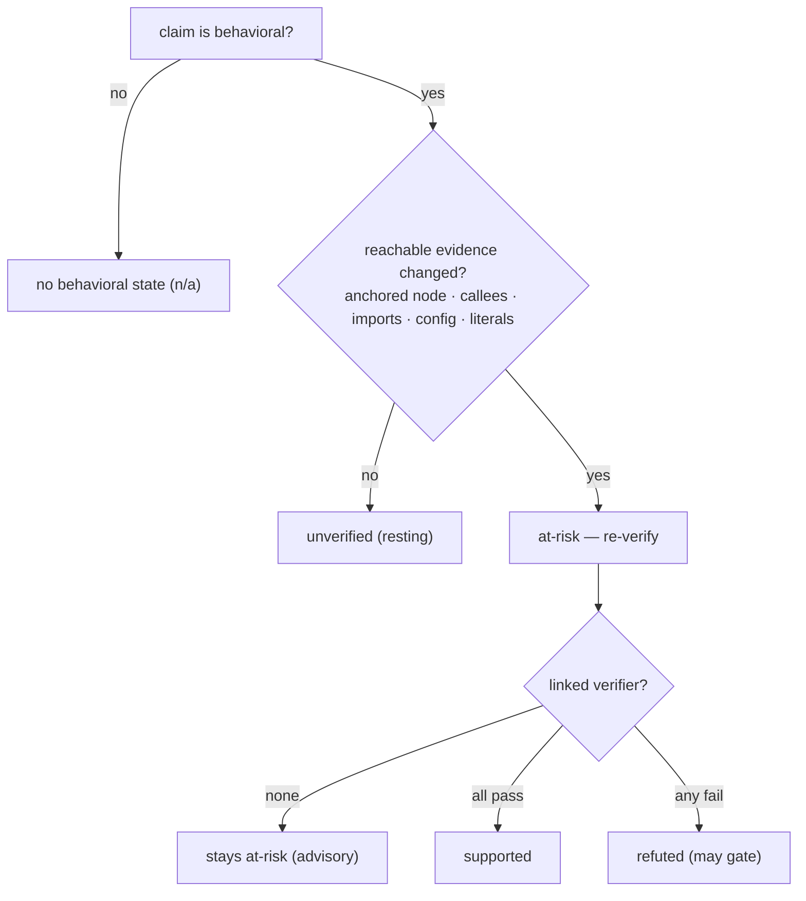

Some claims are about *structure* — "this function is called `retry`", "the
default is `5`". A change to the code either moves that span or it doesn't, and
Hibi's text and syntax tiers can grade it directly.

Other claims are about *behavior*: "retries with exponential backoff", "sorts
ascending", "runs in O(n)", "is thread-safe". These are the kinds of sentences
that drift most quietly, because the code can change shape — a new early return,
a swapped comparator, a dropped lock — while the documented sentence sits there
reading as if nothing happened.

This page is about how Hibi treats that second kind without ever asking a model
whether the sentence is *true*.

## The mental model: route attention, then verify

A behavioral claim asserts something only the running program can settle. Hibi's
structural tiers can tell you the code *changed*; they cannot tell you the
documented behavior still *holds*. Judging truth needs an **oracle** — something
that can actually decide the question.

So Hibi does two separate things, and keeps them separate:

1. **Route attention deterministically.** When the code a behavioral claim
   depends on changes, Hibi marks the claim **at-risk** — a flag that says
   "re-verify this," nothing more. This is pure, repeatable bookkeeping over the
   code, with no model involved.
2. **Run author-supplied executable checks.** If you've linked a **verifier** (a
   test, a snapshot, a property check), Hibi dispatches it out-of-process. The
   verifier — not Hibi, and not a model — decides `supported` or `refuted`.

<Note>
  A flag is a request to **re-verify**, not a claim that the doc is wrong. On a
  behavioral claim, **at-risk** means the evidence under the sentence moved — it
  does not mean the documented behavior is false.
</Note>

### The determinism boundary

This is the line Hibi will not cross: the two structural tiers detect
*structural change*, not *behavioral truth*. Truth requires an oracle, and Hibi
declines to be a probabilistic one.

| Tier | What it can prove | How |
|---|---|---|
| Tier 1 — text | the documented span moved or changed | fuzzy text-quote match + normalized similarity |
| Tier 2 — structural | a code symbol moved or its shape changed | tree-sitter `ast-node` + a two-tier AST hash |
| Tier 3 — behavioral | *attention routing* + executable verdicts | change-gate (deterministic) + verifiers (out-of-process) |

Tier 3 never introduces a model into the decision. **Deterministic — no model
runs in the check loop.** The same working tree always yields the same
behavioral verdicts.

## Classification: a label, never a verdict

Before any of this, Hibi needs to know a claim *is* behavioral. You declare it
when you record the claim, or Hibi infers it from a deterministic keyword
heuristic. Either way the result is a **label** — it tells Hibi to apply the
change-gate. It is never itself a verdict.

You set the kind with `--claim-kind` on `hibi record`. The recognized kinds:

| `--claim-kind` | Example sentence it fits |
|---|---|
| `ordering` | "returns results sorted ascending" |
| `retry` | "retries with exponential backoff" |
| `complexity` | "runs in O(n) time" |
| `concurrency` | "is safe to call from multiple threads" |
| `caching` | "memoizes the result per key" |
| `validation` | "rejects inputs longer than 256 bytes" |
| `error-handling` | "throws on a missing field" |

A claim with one of these labels is behavioral and carries the second
verdict axis. A claim without one carries no behavioral state at all — its
verdict shows `behavior` as `n/a`.

## The change-gate

The change-gate is the heart of Tier 3. It answers one question: *should this
behavioral claim be re-verified right now?*

A behavioral claim goes **at-risk if and only if** it is behavioral **and**
reachable evidence actually changed. "Reachable evidence" is concrete and
deterministic — any of:

- the **anchored node's semantic hash** (the construct the claim points at
  changed in a way that survives renaming and whitespace);
- a node inside the claim's **`behaviorScope`** — its callees and what they
  transitively reach, plus the imports, config, and literal values in that
  blast radius;
- a **linked verifier's source** changed.

If none of that moved — a clean tree, or a change that lands outside the scope —
the claim stays **unverified (resting)**. And critically: rewording the *prose*
of the doc never fires the gate. **Wording alone never fires.**

Caption: Wording alone never fires. A behavioral claim goes at-risk only when
reachable evidence actually changes.

### `behaviorScope`: defining "reachable"

You bound what counts as reachable with the claim's `behaviorScope`. Left
unset, Hibi watches just the anchored node and a shallow neighborhood; set it
when the behavior spans several functions.

<ParamField path="rootSymbols" type="string[]">
  The symbols whose bodies anchor the behavior — the starting points for
  reachability.
</ParamField>
<ParamField path="reachableDepth" type="number" default="2">
  How many call hops out from `rootSymbols` to follow. A change to a callee
  within this depth counts as reachable evidence.
</ParamField>
<ParamField path="include" type="string[]">
  Extra paths or globs to fold into the scope — config files, generated tables,
  anything the behavior depends on that the call graph won't reach.
</ParamField>
<ParamField path="exclude" type="string[]">
  Paths or globs to drop from the scope, so unrelated churn nearby doesn't keep
  flagging the claim.
</ParamField>

The four behavioral belief states the gate produces:

| State | Meaning |
|---|---|
| `unverified` | behavioral, untested, nothing changed (resting) |
| `at-risk` | reachable evidence changed; belief no longer justified — re-verify |
| `supported` | a linked verifier passed |
| `refuted` | a linked verifier failed (the only behavioral state that may gate) |

## Verifiers: turning a flag into a verdict

**at-risk** tells you to look; a **verifier** lets a machine look for you. A
verifier is an author-supplied executable check linked to the claim. When the
gate fires, Hibi dispatches the linked verifiers and upgrades the belief from
the bare flag to a real verdict.

You attach one with `--verifier kind:ref` on `hibi record` (repeatable). The
recognized kinds:

| `kind` | What it runs |
|---|---|
| `example` | a runnable example whose output must match the documented behavior |
| `snapshot` | a stored snapshot the current output is compared against |
| `contract` | an interface/contract check against the implementation |
| `property` | a property-based test exercising invariants |
| `formal` | a formal check (model checker / prover) supplied out-of-process |
| `command` | an arbitrary command whose exit status decides the result |

How the outcome maps to belief:

<Steps>
  <Step title="all linked verifiers pass">
    The claim becomes **supported**.
  </Step>
  <Step title="any linked verifier fails">
    The claim becomes **refuted** — the only behavioral state that can gate, and
    only on an enforced claim.
  </Step>
  <Step title="no verifier is declared">
    The claim can never reach **supported**. With evidence moving it sits at
    **at-risk** (advisory); otherwise it rests at **unverified**.
  </Step>
</Steps>

<Warning>
  Verifiers run **out-of-process**, dispatched to a runner resolver. The engine
  never executes a verifier in-process — that keeps the deterministic core free
  of arbitrary code, and keeps your test harness, language, and runtime entirely
  your own.
</Warning>

### How behavioral state interacts with gating

The behavioral axis is deliberately reluctant to fail your build:

- **at-risk never gates.** It surfaces as a warning (exit code `3`) so a moved
  target nudges you to look without blocking the merge.
- **refuted gates**, but only on an **enforced** claim — a confirmed claim that
  Hibi is allowed to stamp and block on. A failing verifier on a `suggested`
  (candidate) claim never sets a failing exit code.
- **unverified** and **supported** are clean.

The full two-axis verdict and exit-code contract live on the verdicts page; this
page covers only how a behavioral claim earns its state.

## The advisor boundary

You may wire in an opt-in LLM or formal-method resolver — something that can read
a refuted result and *explain* it, or triage which at-risk claims are most worth
your time. Hibi welcomes that, with one fixed limit:

<Warning>
  An advisor **never gates** and can **never mark a claim supported**. Only a
  passing executable verifier produces `supported`; only a failing one produces
  `refuted`. The advisor is out-of-process, opt-in, and advisory — it explains
  and triages, it does not decide.
</Warning>

This is the same boundary as the determinism rule, seen from the other side: the
moment a model could move a claim to `supported` or fail your build, "is this doc
current?" would stop being a repeatable signal. Hibi keeps the verdict path
model-free on purpose, and the design page lays out the evidence for why that
matters.

## Where this fits

<CardGroup cols={2}>
  <Card title="Verdicts, states & exit codes" icon="scale-balanced" href="/verdicts">
    The full two-axis model and how a behavioral state becomes an exit code.
  </Card>
  <Card title="Resolvers" icon="puzzle-piece" href="/resolvers">
    The out-of-process protocol that runs verifiers and hosts the optional advisor.
  </Card>
  <Card title="Why Hibi" icon="compass" href="/design">
    The evidence behind keeping every verdict deterministic and model-free.
  </Card>
  <Card title="Anchors & selectors" icon="anchor" href="/anchors">
    The text and structural tiers the behavioral tier sits on top of.
  </Card>
</CardGroup>
