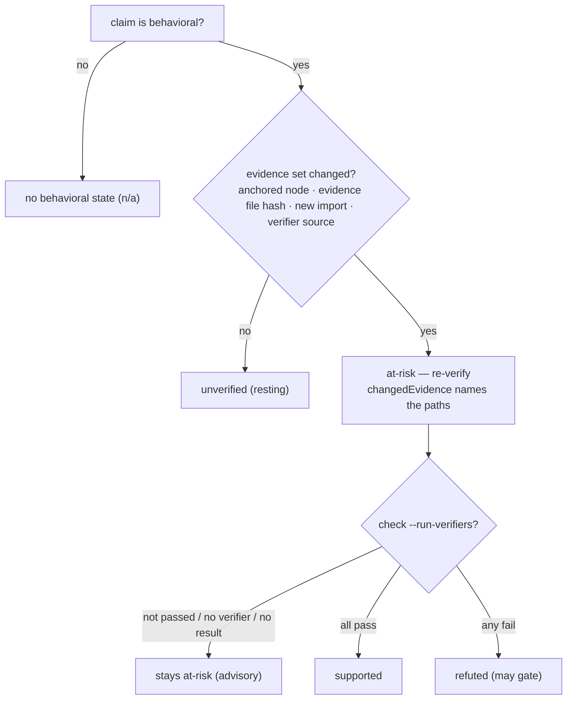

Some claims are about *structure*: "this function is called `retry`", "the
default is `5`". A change to the code either moves that span or it doesn't, and
Hibi's text and syntax tiers can grade it directly.

Other claims are about *behavior*: "retries with exponential backoff", "sorts
ascending", "runs in O(n)", "is thread-safe". These sentences drift the most,
because the code can change shape (a new early return, a swapped comparator, a
dropped lock) while the documented sentence sits there reading as if nothing
happened.

Hibi treats that second kind without ever asking a model whether the sentence is
*true*.

## The mental model: route attention, then verify

A behavioral claim asserts something only the running program can settle. Hibi's
structural tiers can tell you the code *changed*; they cannot tell you the
documented behavior still *holds*. Judging truth needs an **oracle**: something
that can decide the question.

Hibi does two things, and keeps them apart:

1. **Route attention deterministically.** When a file in a behavioral claim's
   **evidence set** changes, Hibi marks the claim **at-risk**, a flag that says
   "re-verify this," nothing more. This is pure, repeatable bookkeeping over the
   code, with no model involved.
2. **Run author-supplied executable checks, on explicit opt-in.** If you've
   linked a **verifier** (a test, a snapshot, a property check) and you pass
   `--run-verifiers` to `hibi check`, Hibi dispatches it out-of-process. The
   verifier, not Hibi and not a model, decides `supported` or `refuted`.

<Note>
  A flag is a request to **re-verify**, not a claim that the doc is wrong. On a
  behavioral claim, **at-risk** means the evidence under the sentence moved. It
  does not mean the documented behavior is false.
</Note>

### The determinism boundary

This is the line Hibi will not cross: the two structural tiers detect
*structural change*, not *behavioral truth*. Truth requires an oracle, and Hibi
declines to be a probabilistic one.

| Tier | What it can prove | How |
|---|---|---|
| Tier 1: text | the documented span moved or changed | fuzzy text-quote match + normalized similarity |
| Tier 2: structural | a code symbol moved or its shape changed | tree-sitter `ast-node` + a two-tier AST hash |
| Tier 3: behavioral | *attention routing* + executable verdicts | change-gate (deterministic) + verifiers (out-of-process, opt-in) |

Tier 3 never introduces a model into the decision. **Deterministic: no model
runs in the check loop.** The same working tree always yields the same
behavioral verdicts.

## Classification: a flag, never a verdict

Before any of this, Hibi needs to know a claim *is* behavioral. That is a
single optional boolean on the assertion — **`behavioral`** — and it resolves
by a three-way rule. Either way the result is a **label**: it tells Hibi to
apply the change-gate. It is never itself a verdict.

- **`behavioral: true`** — the claim is behavioral, wording irrelevant. The
  author's declaration wins.
- **absent** — the claim is behavioral if and only if a deterministic keyword
  heuristic matches (keyword language like "sort" / "retry" / "cache" /
  "O(n)" / "thread-safe", comparison/ordering language, temporal/sequencing
  language, or exception/error language), **or** the claim declares at least
  one verifier — `verifiers[]` being non-empty is itself a behavioral
  declaration.
- **`behavioral: false`** — the claim is not behavioral. The heuristic is
  skipped entirely; this is how you silence a false-positive match.

You set the flag on `hibi record` with `--behavioral` or `--no-behavioral`.
The two are mutually exclusive; passing both is an error.

<Warning>
  **`behavioral: false` with a non-empty `verifiers[]` is a contradiction.** A
  verifier is itself a behavioral declaration — the strongest one there is: an
  action, not a label. The combination is a contradictory record, rejected by
  the schema at `record` time and again at store load. The error points at the
  two legitimate levers for "keep the verifier, quiet the noise": narrow the
  claim's `behaviorScope` (`exclude` globs, or `depth: 0`), or suppress the
  current flag with `hibi ignore --claim <id> --reason <text>`.
</Warning>

There is no enum of behavioral *kinds*. If you want to label a claim's flavor
of behavior (say, "retry"), put the label in the open `attrs` bag — the engine
does not interpret it. The only bit the engine consumes is behavioral or not.

A behavioral claim carries the second verdict axis. Any other claim carries no
behavioral state at all; its verdict shows `behavior` as `n/a`.

## The change-gate

The change-gate is the heart of Tier 3. It answers one question: *should this
behavioral claim be re-verified right now?* It decides by comparing the claim's
**evidence set** against a stored baseline of hashes — fully offline, with git
never on the verdict path.

### The evidence set

At check time, Hibi computes the claim's evidence set deterministically:

- the **anchored node** and the **anchored file**;
- the files the anchored file **imports**, followed out to the scope's `depth`.
  Import edges are extracted per grammar with tree-sitter: TypeScript/TSX
  relative imports, Python relative imports, Rust `mod` declarations. Go and
  Java package imports are not resolvable to files and are **skipped** — for
  those languages, the scope's `include` globs are the lever;
- **plus** anything matched by the scope's `include` globs (config files,
  fixtures, generated tables — dependencies no import edge reaches);
- **minus** anything matched by the scope's `exclude` globs;
- **plus** the source paths of declared verifiers, where resolvable.

There is no call graph — deliberately. Static call graphs miss dynamic
dispatch, reflection, and indirect calls; file-level import reachability is the
honest, deterministic mechanism.

### `behaviorScope`: bounding the evidence set

You bound what counts as evidence with the claim's `behaviorScope`. Left unset,
Hibi watches the anchored file and its direct imports (`depth: 1`); set it when
the behavior depends on more — or on less.

<ParamField path="include" type="string[]">
  Extra paths or globs to fold into the evidence set: config files, generated
  tables, anything the behavior depends on that import extraction won't reach
  (including all dependencies in Go and Java, where package imports are not
  file-resolvable).
</ParamField>
<ParamField path="exclude" type="string[]">
  Paths or globs to drop from the evidence set, so unrelated churn nearby
  doesn't keep flagging the claim.
</ParamField>
<ParamField path="depth" type="number" default="1">
  How many import hops out from the anchored file to follow: `0`, `1`, or `2`.
  `0` watches only the anchored file itself (plus `include` globs and verifier
  sources).
</ParamField>

### `evidenceBaseline`: the stored hashes

At `record` time, Hibi captures **`evidenceBaseline`** on the assertion: a map
from each evidence path to its xxHash64. `reanchor` refreshes it. The baseline
lives in the claim store, so the gate is fully offline — no git on the verdict
path, and `check` stays correct under a shallow clone.

### The firing rule

A behavioral claim goes **at-risk if and only if** it is behavioral **and** at
least one of these holds:

- the **anchored node's semantic hash** changed (the construct the claim points
  at changed in a way that survives renaming and whitespace);
- an **evidence file's current hash** differs from its baseline entry;
- an **evidence path has no baseline entry** — a newly added import is itself a
  change;
- a **declared verifier's source** changed.

If `evidenceBaseline` is absent entirely (a claim recorded with `--no-ast`, for
instance), the gate falls back to the anchored-node signal alone — it does not
flag everything.

If nothing in the evidence set moved (a clean tree, or a change that lands
outside the scope), the claim stays **unverified (resting)**. And
**`doc:changed` never fires the gate**: a doc-side edit is Axis 1's job — the
sentence changed — not withdrawn support for the behavior, so the two axes
never double-fire on one signal. Rewording the *prose* of the doc never fires
the gate. **Wording alone never fires.**

Every `at-risk` verdict names the changed path(s) in its **`changedEvidence`**
and suggests a verifier.



Caption: Wording alone never fires. A behavioral claim goes at-risk only when
its evidence set changes.

The four behavioral belief states the gate produces:

| State | Meaning |
|---|---|
| `unverified` | behavioral, untested, nothing changed (resting) |
| `at-risk` | the evidence set changed; belief no longer justified, re-verify |
| `supported` | a linked verifier passed (under `--run-verifiers`) |
| `refuted` | a linked verifier failed (the only behavioral state that may gate) |

## Verifiers: turning a flag into a verdict

**at-risk** tells you to look; a **verifier** lets a machine look for you. A
verifier is an author-supplied executable check linked to the claim. When you
pass **`--run-verifiers`** to `hibi check`, Hibi dispatches the linked
verifiers and upgrades the belief from the bare flag to a real verdict.

You attach one with `--verifier kind:ref` on `hibi record` (repeatable), for
example `--verifier command:"bun test retry"`.

### Kinds are open strings

A verifier's `kind` is any non-empty string. It is a **dispatch key, not a
taxonomy**: a runner resolver declares the `verifierKinds` it handles in its
`describe` response, and Hibi routes each verifier to a runner by string match.
The conventional kinds — a recommendation, not schema — are:

| Conventional `kind` | What it runs |
|---|---|
| `command` | a shell command whose exit status decides the result (built-in runner) |
| `example` | a runnable example whose output must match the documented behavior |
| `snapshot` | a stored snapshot the current output is compared against |
| `contract` | an interface/contract check against the implementation |
| `property` | a property-based test exercising invariants |
| `metamorphic` | a metamorphic check relating outputs across transformed inputs |
| `formal` | a formal check (model checker / prover) supplied out-of-process |

### The built-in command runner

Hibi ships one runner in-tree: the **command runner**, which handles
`kind: "command"`. It runs the verifier's `ref` as a shell command (`sh -c`,
with the repo root as the working directory) and maps the outcome:

- exit `0` → **supported**;
- non-zero exit → **refuted**;
- timeout or spawn failure → **no result** — the belief stays at whatever the
  deterministic gate decided.

The runner has its own timeout: **120 seconds** by default, adjustable with
`--verifier-timeout <seconds>`. The command runner is what makes `supported`
and `refuted` reachable in a stock install, with no third-party resolver.

### How outcomes fold into belief

Verifier results beat the gate's routing:

<Steps>
  <Step title="any linked verifier fails">
    The claim becomes **refuted**, the only behavioral state that can gate, and
    only on an enforced claim.
  </Step>
  <Step title="all linked verifiers pass">
    The claim becomes **supported**.
  </Step>
  <Step title="otherwise, the gate result stands">
    Without `--run-verifiers`, without a declared verifier, or when a verifier
    produces no result (timeout, spawn failure), the deterministic gate's
    answer holds: **at-risk** (advisory) if evidence moved, **unverified**
    otherwise. A claim with no verifier can never reach **supported**.
  </Step>
</Steps>

### The security model

<Warning>
  Verifiers execute **repo-committed commands** — a supply-chain surface, and
  Hibi treats it as one. Verifiers run **only** under `hibi check
  --run-verifiers`. `status`, `query`, `list`, `doctor`, and plain `check`
  **never** spawn a verifier process, so a read-time gate or an agent hook can
  never trigger arbitrary command execution. External runner resolvers
  additionally require the default-deny manifest (`.claims/resolvers.json`).
</Warning>

Verifiers run **out-of-process**, dispatched to a runner resolver (the built-in
command runner is itself an out-of-process resolver). The engine never executes
a verifier in-process; that keeps the deterministic core free of arbitrary
code, and keeps your test harness, language, and runtime your own.

## Suppression: `hibi ignore`

Sometimes an **at-risk** flag is noise you have already looked at: the evidence
moved, you re-checked, the doc is still right — but you are not ready to
reanchor or wire a verifier. `hibi ignore` acknowledges exactly that state:

```bash
hibi ignore --claim asrt_897e054b48d040db --reason "evidence churn is a comment-only refactor; behavior re-checked by hand"
```

- The command stores the **acknowledged `{path → hash}` map** — the claim's
  current changed evidence — plus the required reason on the assertion
  (`suppressed`).
- While every acknowledged path still sits at its acknowledged hash, the
  at-risk is **non-gating**: it surfaces as `suppressed: true` in the JSON
  verdict and does not affect exit codes.
- The suppression **lapses automatically** the moment any evidence path's hash
  moves past its acknowledged one, or a new evidence path appears. You can
  acknowledge the change you actually looked at — never the next one.

`--reason` is required. An unexplained suppression tells the next reader
nothing, so Hibi refuses to record one.

### How behavioral state interacts with gating

The behavioral axis is reluctant to fail your build:

- **at-risk never gates.** It surfaces as a warning (exit code `3`) so a moved
  target nudges you to look without blocking the merge. A **suppressed**
  at-risk goes further: it does not affect exit codes at all.
- **refuted gates**, but only on an **enforced** claim: a confirmed claim that
  Hibi is allowed to stamp and block on. A failing verifier on a `suggested`
  (candidate) claim never sets a failing exit code.
- **unverified** and **supported** are clean.

The full two-axis verdict and exit-code contract live on the verdicts page; this
page covers only how a behavioral claim earns its state.

## The advisor boundary

You may wire in an opt-in LLM or formal-method resolver, something that can read
a refuted result and *explain* it, or triage which at-risk claims are most worth
your time. Hibi welcomes that, with one fixed limit:

<Warning>
  An advisor **never gates** and can **never mark a claim supported**. Only a
  passing executable verifier produces `supported`; only a failing one produces
  `refuted`. The advisor is out-of-process, opt-in, and advisory: it explains
  and triages, it does not decide.
</Warning>

This is the same boundary as the determinism rule, seen from the other side: the
moment a model could move a claim to `supported` or fail your build, "is this doc
current?" would stop being a repeatable signal. Hibi keeps the verdict path
model-free on purpose, and the design page lays out the evidence for why that
matters.

## Where this fits

<CardGroup cols={2}>
  <Card title="Verdicts, states & exit codes" icon="scale-balanced" href="/verdicts">
    The full two-axis model and how a behavioral state becomes an exit code.
  </Card>
  <Card title="Resolvers" icon="puzzle-piece" href="/resolvers">
    The out-of-process protocol that runs verifiers and hosts the optional advisor.
  </Card>
  <Card title="Why Hibi" icon="compass" href="/design">
    The evidence behind keeping every verdict deterministic and model-free.
  </Card>
  <Card title="Anchors & selectors" icon="anchor" href="/anchors">
    The text and structural tiers the behavioral tier sits on top of.
  </Card>
</CardGroup>
