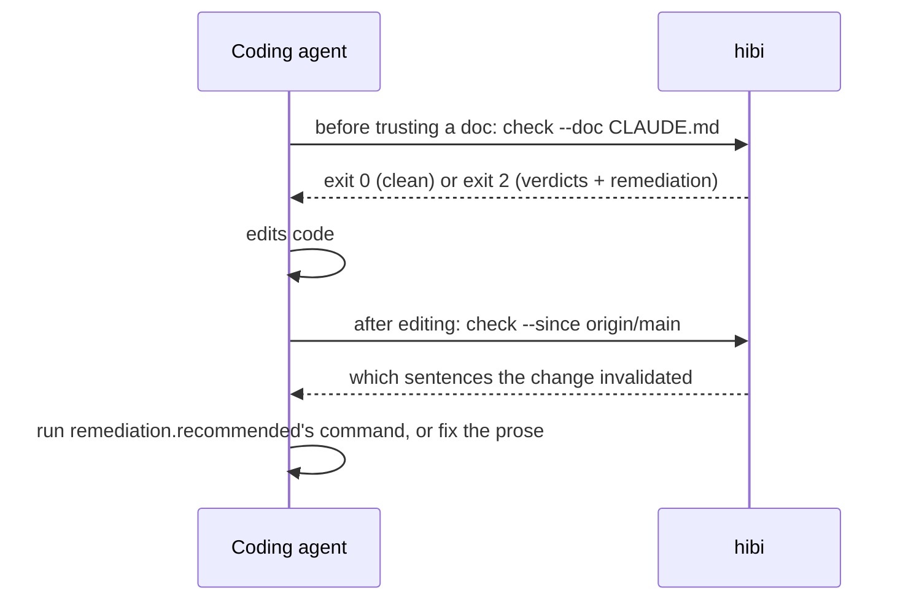

Hibi ships a [Claude Code](https://claude.com/claude-code) **Agent Skill**: instructions the agent loads on demand. The skill covers the vocabulary, the five commands an agent needs (`init`, `record` via JSON on stdin, `check`, `list`, `reanchor`), the JSON shapes, when to run each command, and the verdict-to-action rule.

Hibi is deterministic, so the skill never asks the agent to judge whether a doc is out of date. It teaches the agent to ask Hibi and act on the answer.

## Install

<Steps>
  <Step title="Add the marketplace">
    ```
    /plugin marketplace add npupko/hibi
    ```
  </Step>
  <Step title="Install the plugin">
    ```
    /plugin install hibi-cli@hibi
    ```
  </Step>
</Steps>

Run `/plugin marketplace update` to pull a newer version. The skill does not bundle the `hibi` binary; the agent installs Hibi with the prebuilt binary or `bun add @npupko/hibi`.

## The two moments



## What the skill teaches

<AccordionGroup>
  <Accordion title="Recording claims" icon="anchor">
    The agent sends a JSON array on stdin to `hibi record --from-file -`; keys mirror the flags in camelCase. It quotes the load-bearing token on the code side and sets `verified: true` only after reading the code. New claims are enforced by default; `suggest: true` makes one advisory. `hibi coverage --doc <p>` lists the sentences no claim backs, so the agent grounds them or removes them.
  </Accordion>

  <Accordion title="The read-only commands" icon="arrows-rotate">
    `hibi check` (with `--doc`, `--since`, `--overview`), `hibi list`, and `hibi coverage` are pre-approved in the skill's `allowed-tools`, so the agent runs them without a permission prompt. The mutating verbs (`record`, `reanchor`, `retire`, `supersede`, `archive`, and `check --write`) are not, so a change to the store or a document always passes through you.
  </Accordion>

  <Accordion title="Reading a verdict" icon="scale-balanced">
    Each verdict has `doc` and `code` anchor states, `behavior` when a verifier ran, `expired`, `gates`, and a `remediation` block. The agent reads `remediation.recommended`, finds that action in `actions[]`, and runs its `command`. When there is no `command` (`fix-code`, `fix-claim`, `supersede`), the agent does the work the title names, then runs `hibi check` again. See [Verdicts](/verdicts).
  </Accordion>

  <Accordion title="What the skill forbids" icon="ban">
    Rewriting a sentence to silence a banner. Deleting a `.claims/` file instead of running `hibi retire <id>`. Reanchoring a `behavior:refuted` claim.
  </Accordion>

  <Accordion title="Document lifecycle" icon="arrows-spin">
    `hibi supersede --from <old> --to <new>` relocates the claims whose sentence carried over verbatim and reports the rest as misses. `hibi archive --doc <p> [--successor <p>]` moves a document out of the read path. See [Lifecycle](/lifecycle).
  </Accordion>
</AccordionGroup>

## Session hooks

You can bind the two moments to Claude Code hooks in your own settings:

- **SessionStart**: `hibi check --doc CLAUDE.md`
- **Stop**: `hibi check --since origin/main`

Hibi ships no hook configuration. Both commands are read-only.

## Where this fits

<CardGroup cols={2}>
  <Card title="CI and agents" icon="robot" href="/ci">
    The same exit codes in GitHub Actions and git hooks.
  </Card>
  <Card title="Quickstart" icon="rocket" href="/quickstart">
    Record a claim by hand to see what the skill automates.
  </Card>
</CardGroup>

<Card title="Plugin source" icon="github" href="https://github.com/npupko/hibi/tree/main/plugins/hibi-cli">
  `SKILL.md`, the generated CLI reference, the cookbook, and a drop-in CI workflow.
</Card>
