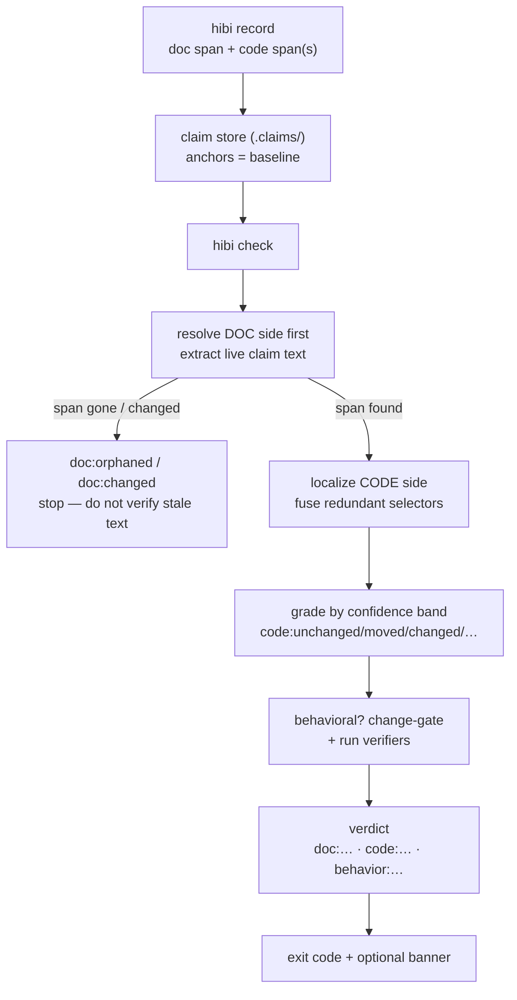

Hibi catches documentation that no longer matches your code. It does that by tracking
**claims**: bindings between a documented sentence and the code that sentence describes.

## The mental model

A **claim** is a sentence in a doc that asserts how the code behaves ("retries up to five
times", "sorts ascending"). Hibi splits each claim into two parts and one connecting anchor:

- A **Proposition**: the timeless *meaning* of the claim, independent of where it is
  written. This is the dedup unit: two docs stating the same thing share one proposition.
- An **Assertion**: a single *verification instance* of that proposition — this sentence, in
  this document, anchored to this code, owned and enforced in a particular way.
- A **bidirectional anchor** that connects the two: a **doc side** (the sentence itself) and
  one or more **code sides** (the code it describes).

The documented span is the source of truth. The store keeps pointers (the anchors), not a
copy of the prose. A stored quote is anchoring material and an audit cache; the authoritative
text is the live document span, re-read every time Hibi runs.

<Info>
  A flag is a request to **re-verify**, not a claim that the doc is wrong. Hibi reports that
  the evidence under a claim moved. The human or agent decides what to do about it.
</Info>

## Redundant anchors

Each side of the anchor is a *bundle* of several redundant **selectors**: different ways to
point at the same span, so no single edit can break the link unnoticed:

- the **quoted text** (`text-quote`), matched fuzzily so it survives small edits and moves;
- its **line/char position** (`text-position`), kept only as a cheap hint and corroboration;
- the **enclosing syntax node** (`ast-node`), parsed with tree-sitter, so reformatting alone
  does not trip it (on the doc side this is the markdown structural path instead);
- any **literal value** (`value`, code side only), so changing `MAX_ATTEMPTS = 5` to `50`
  flags the claim even when nothing else moves;
- an optional **`inline-id`** marker on docs you own that aids re-anchoring but never restates
  the claim, and if the marker and the prose disagree, the prose wins;
- an optional **`path`** or **`glob`** for coarse coverage, used only for navigation and
  blast-radius. Coarse anchors are never reported as stale.

The full anchor model, the six selector kinds in detail, and how their confidence is fused
live on the anchors page.

<Card title="Anchors & selectors" icon="anchor" href="/anchors">
  The bidirectional anchor, the selector kinds, and confidence fusion in full.
</Card>

### Why redundancy

No single signal is robust on its own: positions drift on every edit, quoted text breaks on
reformatting, and syntax nodes move when code is restructured. By fusing several selectors per
side, Hibi distinguishes a harmless reformat (the selectors still agree) from a meaningful
change (they disagree), without running a model in the check loop. Agreement across selectors
is what sets confidence, and confidence is what grades the claim.

## The two axes

When you run `hibi check`, Hibi re-finds each side's selectors in your current files and
grades the result on **two independent axes**, not one flat status:

- **Anchor resolution**: *"can I still find the span, and is it the same?"* Reported per
  side as `doc:…` / `code:…`, with one of five values: `unchanged`, `moved`, `changed`,
  `ambiguous`, or `orphaned`.
- **Behavioral belief**: *"do we still believe the documented behavior holds?"* Present only
  on behavioral claims (absent otherwise): `unverified`, `at-risk`, `supported`, or
  `refuted`. It moves from a resting `unverified` to `at-risk` when reachable evidence
  changes, and becomes `supported` or `refuted` when an executable **verifier** runs.

Hibi keeps the two apart on purpose. The code under a claim can move without the documented
behavior coming into question, and a behavior can come into doubt without the prose changing a
word. One flat status would conflate them.

A verdict therefore reads side-prefixed and middle-dot separated, like
`doc:unchanged · code:changed · behavior:at-risk`. An orthogonal **`expired`** flag (past a
claim's TTL) rides alongside; it is a flag, not a state. The complete state vocabulary,
grading bands, and how a verdict becomes an exit code live on the verdicts page.

<Card title="Verdicts, states & exit codes" icon="scale-balanced" href="/verdicts">
  The full two-axis model, the confidence bands, and the exit-code contract.
</Card>

<Note>
  "Drift" and "stale" are not machine states; they are the human roll-up wording for "any
  claim needing attention", used in the banner headline. The machine speaks only in the two
  axes above. Verdicts are computed live on every check and kept out of the store.
</Note>

## The doc-first flow

A claim runs from `record` through to a verdict and an exit code. Hibi resolves the
**doc side first**.

Hibi resolves the doc side first: a claim whose sentence is gone must not be verified against
code as if it still existed.

<Steps>
  <Step title="Record">
    You record a claim with `hibi record`, pointing at a documented span and the code span(s)
    it describes. The anchors land in the committed claim store under `.claims/` (one file
    per claim) and become the baseline. The anchor *is* the baseline, so `check` runs
    offline and stays correct under a shallow clone.
  </Step>
  <Step title="Resolve the doc side">
    On `check`, Hibi first finds the documented sentence in the current document and extracts
    its live text. If that span is gone or has changed, the claim is `doc:orphaned` or
    `doc:changed`, and Hibi stops. It will not check a sentence that no longer says what it
    once did against the code as if nothing happened.
  </Step>
  <Step title="Localize the code side">
    If the sentence is still there, Hibi localizes the code side: position hint, then fuzzy
    quote match, then the enclosing syntax node. The redundant selectors that resolve are
    fused into a single confidence score.
  </Step>
  <Step title="Grade">
    Fixed bands turn that confidence into a `code:…` resolution state, the structural
    verdict for the code side.
  </Step>
  <Step title="Behavioral routing">
    If the claim is behavioral, a change-gate decides whether reachable evidence
    changed; only then does the belief go `at-risk`. Any linked verifiers run out-of-process
    and can push the belief to `supported` or `refuted`.
  </Step>
  <Step title="Verdict & exit">
    Hibi emits the two-axis verdict, sets the process exit code per its contract, and, when
    you pass `--write`, can stamp a status banner into the document itself.
  </Step>
</Steps>

<Tip>
  Everything here is deterministic: no model runs in the check loop. The same tree always
  produces the same verdicts. That is the property that makes "is this doc stale?" a signal
  you can trust in CI, not a probabilistic guess.
</Tip>

## Where to go next

<CardGroup cols={2}>
  <Card title="Anchors & selectors" icon="anchor" href="/anchors">
    How the bidirectional anchor is built and how its selectors are fused into confidence.
  </Card>
  <Card title="Verdicts, states & exit codes" icon="scale-balanced" href="/verdicts">
    The complete two-axis state model, grading bands, and the gating exit-code contract.
  </Card>
  <Card title="Why Hibi" icon="compass" href="/design">
    The reasoning behind the design: determinism, suspect-not-false, and why no model gates.
  </Card>
</CardGroup>
