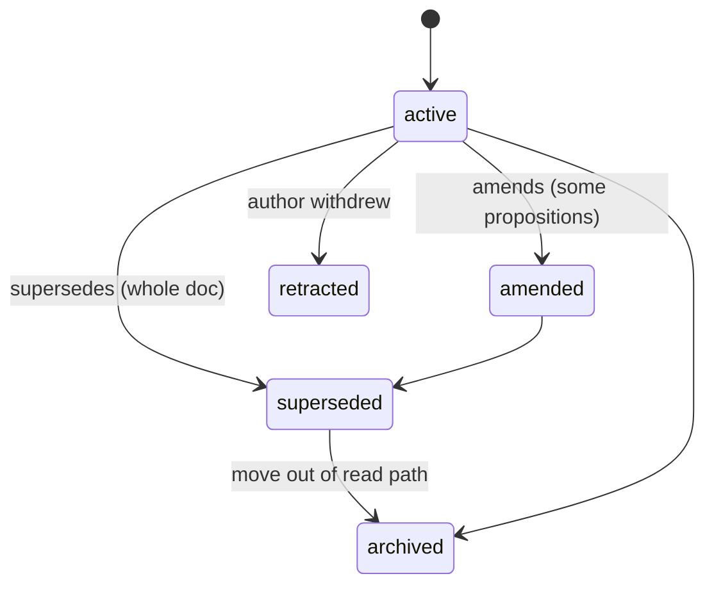

A single word like "stale" hides several different questions. *Did the author
mean this claim to be trustworthy?* *Is Hibi allowed to block a merge over it?*
*Has the code under it moved?* *Has a newer document replaced it?* Hibi keeps
those four questions in **four separate status kinds** and never collapses them
into one flag.

<Note>
  The four kinds answer four different questions and live on different objects.
  Keeping them apart is what lets Hibi say "this doc was partly replaced **and**
  its code drifted" instead of one undifferentiated "stale."
</Note>

## The four status kinds

| Kind | Question it answers | Who sets it | Where it lives |
|---|---|---|---|
| **Authored trust** | How much did the author vouch for this claim? | the author, at `record` time | the Proposition |
| **Enforcement** | Is Hibi allowed to gate or stamp a strong banner over it? | derived at `record`, then explicit | the Assertion |
| **Computed** | Right now, has the evidence moved? | the engine, live on every `check` | nowhere; recomputed, never stored |
| **Document lifecycle** | Where is this document in its life? | authored edges + the engine | the Document |

The first two are **authored**: you decide them when you write the claim. The
third is **computed**: Hibi recalculates it on every run and keeps it out of the
store. The fourth tracks the **document** itself, independent of any one claim.

## Authored trust

When you record a claim you declare how strongly you stand behind it. This is a
statement about your confidence, not about the code.

| Trust | Meaning |
|---|---|
| `verified` | You confirmed the claim against the code; it carries an anchor and a `@ref`. |
| `inferred` | Derived from the code but not directly confirmed. |
| `assumed` | Stated without confirmation: a working assumption. |

<Info>
  `verified` is the only trust level that requires both an anchor and a `@ref`
  (the reference that backs the confirmation). Trust is set with
  `--trust verified|inferred|assumed` on `hibi record`.
</Info>

## Enforcement: earning the right to gate

Enforcement is the gate key. It decides whether a claim can fail your build or
stamp a strong banner into a file, or whether it stays advisory.

| Enforcement | Meaning |
|---|---|
| `suggested` | A candidate claim, advisory only. Never sets a failing exit code. |
| `enforced` | A confirmed claim: may gate a build and may stamp a strong banner. |
| `retired` | Withdrawn from active enforcement, kept for history. |
| `unanchored-legacy` | A pre-existing claim with no usable anchor yet. |

<Warning>
  **Only an `enforced` claim gates or stamps a strong banner.** A `suggested`
  claim is reported but never sets a failing exit code, so unconfirmed candidates
  can never break a build on their own.
</Warning>

### How `record` derives enforcement

You do not pick `enforced` yourself; Hibi earns it for you, and refuses it if
the anchor is too weak to stand behind.

<Steps>
  <Step title="Verified trust plus a precise anchor on both sides → enforced">
    If you record with `verified` trust and the anchor resolves precisely on the
    doc side *and* the code side, the claim is recorded as `enforced`.
  </Step>
  <Step title="Anything weaker → suggested">
    Without verified trust, or without a precise resolvable anchor, the claim is
    recorded as `suggested`, advisory until you confirm it.
  </Step>
  <Step title="An enforced record is refused unless every condition holds">
    `record` throws rather than create a weak `enforced` claim. To be enforced,
    the doc side must resolve, a `@ref` must be present, the code side must be
    precise (not a coarse or `--glob` target), and every code target must
    resolve.
  </Step>
</Steps>

Coarse and `--glob` targets are navigation and blast-radius only: they map
which files a claim touches, but they can never back an `enforced` claim. (Coarse
anchors are never reported as stale either; see how anchors are scored on the
[Anchors & selectors](/anchors) page.)

## Computed states

The third kind, what the engine works out live on every `check`, is the
**two-axis verdict** (`doc:…` / `code:…` resolution, plus a behavioral belief on
behavioral claims) and the orthogonal `expired` flag. These are recomputed every
run and never stored, so they are documented where they are graded rather than
repeated here.

<Card title="Verdicts, states & exit codes" icon="scale-balanced" href="/verdicts">
  The full two-axis model, the grading bands, and how a verdict becomes an exit
  code.
</Card>

## Document lifecycle

A document is more than its claims; it has a life of its own. It can be amended,
replaced wholesale, withdrawn, or moved out of the read path.



Caption: "Supersession is authored forward on the new document; Hibi derives the reverse edge."

| Lifecycle | Meaning |
|---|---|
| `active` | In the read path; treated as current. |
| `amended` | Some of its propositions were replaced by a newer document; the file stays in the read path. |
| `superseded` | Replaced in full by a newer document; should be archived. |
| `archived` | Moved out of the read path, with a tombstone or redirect to its successor. |
| `retracted` | The author withdrew the claim. |

## Supersession: replacing what a document said

When a newer document takes over from an older one, you author that relationship
**forward on the new document**. Hibi derives the reverse edge, so the old
document knows it was replaced without you editing it twice.

<Tabs>
  <Tab title="supersedes (full replacement)">
    `supersedes` points at a whole **Document**. The old document's lifecycle
    flips to `superseded`, and the next step is to archive it.

    ```bash
    hibi supersede --new docs/new.md --old docs/old.md --type supersedes
    ```
  </Tab>
  <Tab title="amends (partial replacement)">
    `amends` points at one or more named **Propositions**: the specific claims
    the new document changes. The old document stays in the read path; only the
    named propositions flip, and its lifecycle becomes `amended`. Proposition ids
    are required.

    ```bash
    hibi supersede --new docs/new.md --old docs/old.md --type amends --propositions p-12,p-19
    ```
  </Tab>
</Tabs>

<Note>
  An old document can be **amended and code-drifted at the same time**: a newer
  doc replaced part of it, and the code under another part moved. Because the four
  status kinds are separate, both conditions surface together rather than masking
  each other.
</Note>

## Remediation: what to do when a claim needs attention

A flag is a request to **re-verify**, not a claim that the doc is wrong. The
response is graduated by how dangerous it is to leave the document standing as-is.

| Condition | Remediation |
|---|---|
| `amended` / superseded-in-part | Stamp a banner and flip the frontmatter status; keep the file. |
| `superseded` / obsolete-in-full | Archive it: move it out of the read path with a tombstone or redirect to the successor. |
| `code:changed` / `code:orphaned` / `expired` | Stamp a banner and flag the specific claims to re-verify. |
| `doc:changed` / `doc:ambiguous` | Banner noting the prose diverged; re-confirm, or `hibi retire <claim-id>`. |
| `doc:orphaned` | The documented sentence was deleted: `hibi reanchor` to a new target, or `hibi retire <claim-id>`. |
| `refuted` | Strong banner, with a configurable gate. |
| `retracted` | Banner noting the author withdrew the claim. |

To withdraw a single obsolete claim, run **`hibi retire <claim-id>`** — it flips
the claim's `enforcement` to `retired` and keeps the audit trail. Never hand-edit
or delete the claim's file under `.claims/`. Every drift verdict carries a
[`remediation`](/verdicts#the-remediation-menu) menu that names the right verb for
its state and pre-fills the command, so you rarely pick from this table by hand.

The mechanics of how a banner is written, made tamper-evident, and placed at the
top of a file live on the [Status banners](/banners) page.

## Who does what

Hibi draws a hard line between the part it owns and the part it leaves to you.

<CardGroup cols={2}>
  <Card title="The engine owns" icon="gears">
    Status, document edges, lifecycle stamping, archival, and flagging the
    content that needs attention. Deterministic: no model runs in the check loop.
  </Card>
  <Card title="You (or your agent) own" icon="pen">
    Rewriting the prose, then re-running `hibi check`. **The engine never writes
    prose**: it tells you what moved, and you decide what the doc should now say.
  </Card>
</CardGroup>

<Check>
  The engine flags and stamps; the author or agent rewrites and re-runs. That
  split is what keeps the signal trustworthy and the prose human.
</Check>

## Where to go next

<CardGroup cols={2}>
  <Card title="Status banners" icon="stamp" href="/banners">
    How a status becomes a visible, tamper-evident banner in the file itself.
  </Card>
  <Card title="CLI reference" icon="terminal" href="/cli-reference">
    `record`, `supersede`, `retract`, `archive`, and the rest of the verbs.
  </Card>
</CardGroup>
