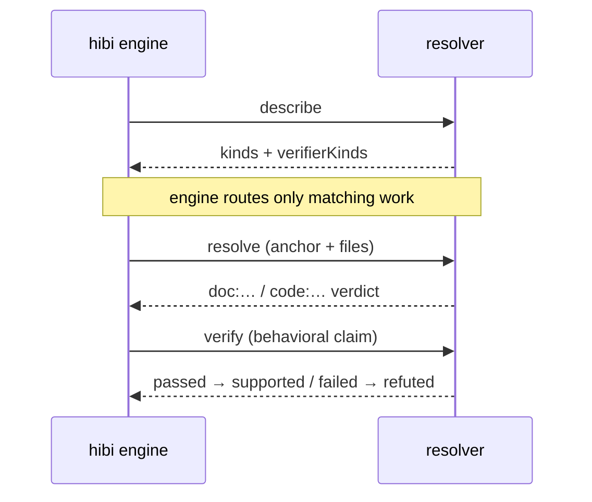

A **resolver** is an external program that does the work of grading an
anchor or running a verifier. Hibi's core is tiny ("if it isn't core, it's a
resolver or a consumer"), so even the built-in drift and
supersession logic ships *as resolvers* behind the same contract. To teach Hibi
about a new language, a new anchor kind, or a new way to verify behavior, you
write a resolver in any language and point Hibi at it.

## The mental model

The engine owns the loop: it reads your files, decides which claims to check,
collects verdicts, computes exit codes, and stamps banners. It does *not* know
how to grade an anchor by itself. That knowledge lives in resolvers, which the
engine drives over a small RPC protocol.

This keeps two promises. First, a resolver runs **out-of-process** (a separate
program the engine talks to over its standard input and output), so a resolver
crash, hang, or dependency never destabilizes the core, and the engine never has
to load a resolver's runtime. Second, the boundary is **deterministic by
default**: the resolvers that produce verdicts are pure graders fed the
file contents they need. A flag is a request to **re-verify**, not a claim that
the doc is wrong, and that contract holds no matter which resolver produced it.

<Note>
  The built-in code-anchor, doc-anchor, and supersession resolvers ship in-tree,
  but they speak the same protocol as anything you write. There is no privileged
  internal path; your resolver is a first-class participant.
</Note>

## The protocol

Resolvers communicate over **JSONL-RPC over stdio**: newline-delimited JSON-RPC
messages on the program's standard input and output. The engine sends a request,
the resolver writes back a response, one JSON object per line. No network, no
ports, no shared memory.

There are three methods.

<ParamField path="describe" type="method">
  Announce what this resolver handles: the anchor `kinds` it can grade and the
  `verifierKinds` it can run. The engine calls `describe` first and routes work
  only to resolvers that claim it.
</ParamField>

<ParamField path="resolve" type="method">
  Grade an assertion's anchor into a verdict. The engine reads both sides of the
  bidirectional anchor and passes the file contents in as `files { doc, code: {
  path: content } }`, so the resolver stays pure: it grades what it is handed
  and never touches the filesystem itself. It returns a verdict on the anchor
  resolution axis (`unchanged` / `moved` / `changed` / `ambiguous` / `orphaned`).
</ParamField>

<ParamField path="verify" type="method">
  Run an executable **verifier** for a behavioral claim and report whether it
  passed. A pass contributes `supported`; a failure contributes `refuted` (the
  only behavioral state that may gate, and only on an enforced claim). The engine
  itself never executes verifiers in-process; it dispatches them to a runner
  resolver through this method.
</ParamField>

A round-trip for one claim looks like this:



The engine asks what a resolver can do, then hands it only the work it claimed and the file contents it needs.

## Enabling a resolver

Resolvers stay off until you list them. The manifest is **default-deny**: a
resolver that is not in `.claims/resolvers.json` is never launched, so dropping a
file in a directory can never start running code in your check loop.

```jsonc .claims/resolvers.json
// Opt in to the optional semantic advisor (it advises, it does not gate)
{
  "resolvers": [
    {
      "name": "semantic-advisor",
      "command": "bun",
      "args": ["run", "resolvers/semantic-advisor.ts"]
    }
  ]
}
```

<Warning>
  An opt-in semantic resolver (an LLM or formal advisor) may explain a change
  or triage a suspect set, but it **never gates** and never marks a claim
  `supported`. Verdicts on the gating path stay deterministic; advisory output is
  layered context on top, never the decision. This is the determinism boundary:
  no model runs on the verdict path.
</Warning>

## Where resolvers fit

Two distinct out-of-process roles ride the same protocol, and it is worth keeping
them apart:

| Role | Method | Effect on the verdict |
|---|---|---|
| Anchor grader | `resolve` | Produces the `doc:…` / `code:…` resolution state; deterministic; can gate via `changed` / `orphaned` / `ambiguous`. |
| Verifier runner | `verify` | Runs an executable check; a failure yields `refuted` (may gate on an enforced claim); a pass yields `supported`. |
| Advisor (opt-in) | `resolve` / `verify` | Explains or triages only; never gates, never marks `supported`. |

The verifier runner is how Hibi proves behavioral claims that structural checks
cannot judge on their own: "retries with backoff", "sorts ascending". The engine
detects that reachable evidence changed and routes attention; an author-supplied
verifier, dispatched through `verify`, is what can confirm or refute the
belief. The full behavioral model lives on its own page.

<Card title="Behavioral claims & verifiers" icon="flask-vial" href="/behavioral">
  How the change-gate routes attention and how verifiers push a belief to
  supported or refuted, without a model on the verdict path.
</Card>

## Writing your own

Because the protocol is plain JSONL-RPC over stdio, a resolver is any program
that reads requests on its standard input and writes responses on its standard
output. You handle the framing yourself, or you lean on an SDK that does it for
you.

<Steps>
  <Step title="Implement the three methods">
    Respond to `describe`, `resolve`, and `verify`. A grader that only handles
    anchors can leave `verify` as a no-op; a verifier runner can return an empty
    `kinds` list from `describe` and handle only `verify`.
  </Step>
  <Step title="Validate against the schemas">
    Every protocol message has a published JSON Schema, so you can validate
    requests and responses in any language with a JSON Schema toolchain, no need
    to hand-transcribe the shapes.
  </Step>
  <Step title="List it in the manifest">
    Add the resolver to `.claims/resolvers.json` with its `command` and `args`.
    Until it appears there, the default-deny manifest keeps it off.
  </Step>
</Steps>

The JSON Schemas for every protocol message
([`schemas/*.v1.json`](https://github.com/npupko/hibi/tree/main/schemas)) are
generated from the single Zod source of truth, so the schema and the engine can
never disagree, and any language that can read JSON Schema can validate against
them.

<Tip>
  You rarely need to handle JSONL-RPC framing by hand. The TypeScript and Rust
  SDKs implement `describe` / `resolve` / `verify` for you, leaving you to write
  only the grading logic.
</Tip>

## Where to go next

<CardGroup cols={2}>
  <Card title="SDKs" icon="cube" href="/sdks">
    The TypeScript and Rust SDKs that handle protocol framing so you write only
    the resolver logic.
  </Card>
  <Card title="Behavioral claims & verifiers" icon="flask-vial" href="/behavioral">
    The change-gate and verifier model behind the `verify` method.
  </Card>
</CardGroup>
