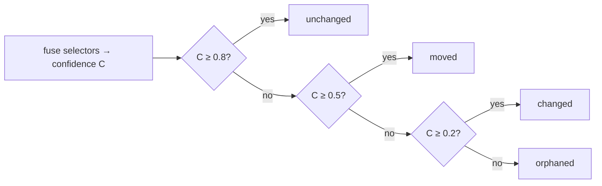

When `hibi check` runs, every claim produces a **verdict**: a small, structured
judgement about whether the code and the documented sentence still line up. A
verdict is not a single label like "stale" or "fine." It separates two questions
that drift conflates, and answers each on its own axis.

A verdict reads like this:

```text
doc:unchanged · code:changed · behavior:at-risk
```

Lowercase, middle-dot separated, and **side-prefixed** so you can see at a glance
which side moved. Here the documented sentence is intact (`doc:unchanged`), the
code it points at has changed (`code:changed`), and because the claim is
behavioral, the belief that the described behavior still holds is now suspect
(`behavior:at-risk`).

<Note>
  Verdicts are **recomputed live on every `check`** and never stored. The claim
  store holds the authored record and its anchors — the baseline — not the
  judgement. The same working tree always yields the same verdicts, because no
  model runs in the check loop.
</Note>

## The two axes

Hibi grades a claim on two independent axes. Keeping them separate is the whole
point: "I can no longer find the code" is a different problem from "the behavior
the doc promised is no longer justified," and collapsing them loses information.

<CardGroup cols={2}>
  <Card title="Axis 1 — Anchor resolution" icon="anchor">
    Per side (`doc:…` / `code:…`). Can Hibi still find the span, and is it the
    same? Always present on both sides.
  </Card>
  <Card title="Axis 2 — Behavioral belief" icon="flask-vial">
    Only on behavioral claims. Do we still believe the described behavior holds?
    Absent (`n/a`) on a plain structural claim.
  </Card>
</CardGroup>

### Axis 1 — anchor resolution

Anchor resolution answers a mechanical question, asked once per side: *given the
selectors Hibi recorded, can it still locate the span in the current file, and is
the content there the same?* It uses one vocabulary, prefixed with the side it
describes (`doc:` or `code:`).

| State | Meaning |
|---|---|
| `unchanged` | found, identical |
| `moved` | found, relocated (same content) — re-anchorable |
| `changed` | found, content differs |
| `ambiguous` | matches in more than one place |
| `orphaned` | span deleted / unresolvable |

The doc side is resolved **first**. A claim whose source sentence is gone or has
itself changed must not be verified against code as if it still existed — so a
`doc:orphaned` or `doc:changed` result stops the check before the code side is
ever judged. (Anchors and the selectors behind them are covered in full on the
[Anchors](/anchors) page.)

### Axis 2 — behavioral belief

Some claims assert things a structural check cannot prove on its own — "retries
with backoff," "sorts ascending," "thread-safe." For those, Hibi tracks a second
axis: whether the *belief* that the behavior still holds is still justified. It
appears only on behavioral claims; on every other claim it is simply absent
(`n/a`).

| State | Meaning |
|---|---|
| `unverified` | behavioral, untested, nothing changed (resting) |
| `at-risk` | reachable evidence changed; belief no longer justified — re-verify |
| `supported` | a linked verifier passed |
| `refuted` | a linked verifier failed (the only behavioral state that may gate) |

This axis goes `at-risk` only when reachable evidence actually changes — wording
alone never moves it. How that change-gate decides, and how executable verifiers
turn `at-risk` into `supported` or `refuted`, is covered on the
[Behavioral claims](/behavioral) page.

### The `expired` flag

Separate from both axes, a claim can carry a time-to-live. Once it is past that
`ttl`, the verdict carries an **`expired`** flag. This is a flag, **not a state**:
it rides alongside the two axes rather than replacing either, and it is the
author saying "re-confirm this periodically regardless of whether anything
changed."

<Tip>
  "Drift" and "stale" are not machine states. They are the human roll-up wording
  — shorthand for "any claim that needs attention" — used in the banner headline
  and in conversation. The machine only ever emits the axis states above plus the
  `expired` flag.
</Tip>

## The verdict shape

The JSON a verdict serializes to is **verdict-first**: the decision comes before
the evidence, so a truncated or streamed read still surfaces what matters.

```json
{
  "doc": "unchanged",
  "code": "changed",
  "behavior": "at-risk",
  "expired": false,
  "gates": true,
  "evidence": { }
}
```

The `behavior` key is present only on behavioral claims. `gates` records whether
this verdict alone is enough to fail the run (see exit codes below). `evidence`
trails at the end and holds the bulky supporting detail — matched offsets,
similarity scores, which selectors resolved — that you rarely need but can always
inspect. Lead with the decision; trail the proof.

## How a code-side grade is computed

The anchor-resolution state on the code side is not read off a single signal. Each
side bundles several redundant selectors, Hibi re-finds the ones it can, and fuses
their agreement into a single **confidence** number `C` between 0 and 1. That
number is then mapped to a band.



Fewer than two selectors resolve → orphaned. An unchanged hit that relocated by
more than 4 characters is downgraded to moved.

The bands are fixed:

| Confidence `C` | State |
|---|---|
| `C ≥ 0.8` | `unchanged` |
| `0.5 ≤ C < 0.8` | `moved` |
| `0.2 ≤ C < 0.5` | `changed` |
| `C < 0.2` | `orphaned` |

Confidence is a weighted average over the selectors that **resolved**:
`C = Σ(wᵢ·sᵢ) / Σ(wᵢ)`, with weights `ast-node 0.35`, `text-quote 0.30`,
`value 0.20`, `text-position 0.15`. A few rules sharpen the result:

- **Two-selector minimum.** With fewer than two selectors resolved, the result is
  `orphaned` at confidence 0 — one lone signal is not enough to trust.
- **Move-awareness.** A result that would grade `unchanged` is downgraded to
  `moved` if the located start differs from the baseline start by more than **4
  characters**. The content is the same; it just relocated.
- **Ambiguity.** A quote that is unique in the baseline but now matches in more
  than one place grades `ambiguous` — Hibi will not guess which match is the real
  one.
- **Value veto.** If a `value` selector changed (so `MAX_ATTEMPTS = 5` became
  `50`) while the surrounding `text-quote` is still ≥ 0.9 similar, the result is
  forced to `changed` at confidence `0.3`. A literal flipping under unchanged
  prose is exactly the silent drift Hibi exists to catch.
- **Structural-only match.** A pure rename or whitespace reshuffle that the AST
  still recognizes scores the `ast-node` selector at `0.40`.

<Note>
  Fuzzy matching uses a Bitap matcher with `Match_Threshold 0.4` and
  `Match_Distance 100000`, over a 32-character context window. The full selector
  model, weights, and tiers live on the [Anchors](/anchors) page.
</Note>

### Precision over recall

The grading is deliberately tuned so that a missed call lands on the safe side.
False `changed` results — crying wolf on code that did not really change — are
held at or below roughly 2%. More importantly, Hibi **never reports a drifted
claim as `unchanged`**: every drift it misjudges grades `moved`, which still means
"re-verify." Over-flagging erodes trust, but a silent false `unchanged` would
defeat the tool entirely, so the thresholds err toward `moved` rather than toward
a clean pass.

## Verdicts become exit codes

A verdict is information; an exit code is a decision the surrounding tooling can
act on. After grading every claim, `hibi check` reduces the run to a single
process exit code.

| Code | Meaning |
|---|---|
| `0` | all clean |
| `2` | gating: `changed` / `orphaned` / `ambiguous` (either side), `expired`, or `refuted`, on an **enforced** claim |
| `3` | warning: `moved` or `at-risk` (re-anchorable / advisory) |
| `1` | operational error |

Two rules keep the suspect set tight and trustworthy:

<Warning>
  **`moved` and `at-risk` never gate.** A relocated span is re-anchorable and a
  behavioral claim without a failing verifier is only advisory — neither is strong
  enough to fail a build on its own. They surface as the warning code `3`.
</Warning>

<Check>
  **`suggested` claims never set a failing exit code.** Only a claim recorded as
  **enforced** can drive exit `2` or stamp a strong banner. A candidate claim that
  has not yet been confirmed stays advisory no matter what its anchors do.
</Check>

The distinction between `suggested` and `enforced` records — and how `record`
decides which one you get — is part of the trust and enforcement model on the
[Trust, enforcement & lifecycle](/lifecycle) page.

## Choosing how strict to be

The `--fail-on` flag on `check` sets where the line falls between "fail the run"
and "just report." It does not change how claims are graded, only which grades
turn into a failing exit code.

| `--fail-on` | Behavior |
|---|---|
| `gating` | **Default.** Fail on gating verdicts (exit `2`). |
| `warn` | Also fail on warnings — `moved` and `at-risk` (exit `3`) become failing too. |
| `tamper` | Fail only when a stamped banner has been tampered with. |
| `never` | Report everything, never fail. |

<Info>
  `--fail-on tamper` is for the case where the only thing you want to block is a
  hand-edited status banner — Hibi detects the edit via the banner's checksum and
  can refuse to let a falsified "current" stamp through.
</Info>

## Where to go next

<CardGroup cols={2}>
  <Card title="Behavioral claims & verifiers" icon="flask-vial" href="/behavioral">
    The change-gate, the no-model boundary, and how verifiers turn `at-risk` into
    `supported` or `refuted`.
  </Card>
  <Card title="Anchors & selectors" icon="anchor" href="/anchors">
    The selector kinds, redundancy, and the confidence fusion behind every grade.
  </Card>
  <Card title="CLI reference" icon="terminal" href="/cli-reference">
    Every command and flag, including `check` and `--fail-on`.
  </Card>
  <Card title="Trust, enforcement & lifecycle" icon="arrows-spin" href="/lifecycle">
    Why only enforced claims gate, and how a doc's lifecycle status is set.
  </Card>
</CardGroup>
