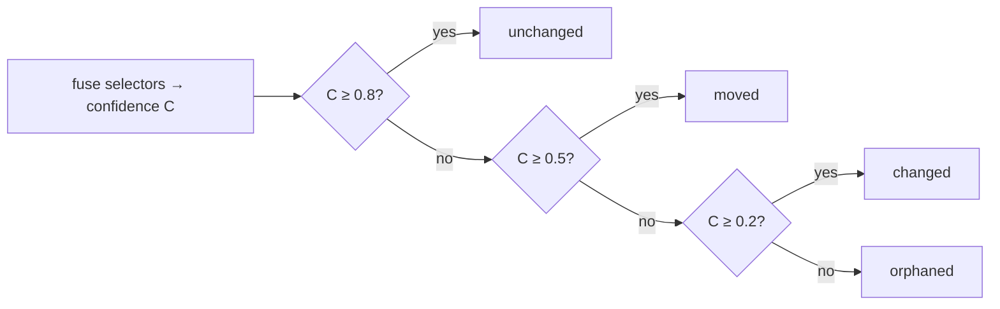

When `hibi check` runs, every claim produces a **verdict**: a small, structured
judgement about whether the code and the documented sentence still line up. A
verdict is not a single label like "stale" or "fine." It separates two questions
that drift conflates, and answers each on its own axis.

A verdict reads like this:

```text
doc:unchanged · code:changed · behavior:at-risk
```

Lowercase, middle-dot separated, and **side-prefixed** so you can see at a glance
which side moved. Here the documented sentence is intact (`doc:unchanged`), the
code it points at has changed (`code:changed`), and because the claim is
behavioral, the belief that the described behavior still holds is now suspect
(`behavior:at-risk`).

<Note>
  Verdicts are **recomputed live on every `check`** and never stored. The claim
  store holds the authored record and its anchors (the baseline), not the
  judgement. The same working tree always yields the same verdicts, because no
  model runs in the check loop.
</Note>

## The two axes

Hibi grades a claim on two independent axes, and keeps them separate on purpose:
"I can no longer find the code" is a different problem from "the behavior
the doc promised is no longer justified," and collapsing them loses information.

<CardGroup cols={2}>
  <Card title="Axis 1: Anchor resolution" icon="anchor">
    Per side (`doc:…` / `code:…`). Can Hibi still find the span, and is it the
    same? Always present on both sides.
  </Card>
  <Card title="Axis 2: Behavioral belief" icon="flask-vial">
    Only on behavioral claims. Do we still believe the described behavior holds?
    Absent (`n/a`) on a plain structural claim.
  </Card>
</CardGroup>

### Axis 1: anchor resolution

Anchor resolution answers a mechanical question, asked once per side: *given the
selectors Hibi recorded, can it still locate the span in the current file, and is
the content there the same?* It uses one vocabulary, prefixed with the side it
describes (`doc:` or `code:`).

| State | Meaning |
|---|---|
| `unchanged` | found, identical |
| `moved` | found, relocated (same content), re-anchorable |
| `changed` | found, content differs |
| `ambiguous` | matches in more than one place |
| `orphaned` | span deleted / unresolvable |

The doc side is resolved **first**. A claim whose source sentence is gone or has
itself changed must not be verified against code as if it still existed, so a
`doc:orphaned` or `doc:changed` result stops the check before the code side is
ever judged. (Anchors and the selectors behind them are covered in full on the
[Anchors](/anchors) page.)

### Axis 2: behavioral belief

Some claims assert things a structural check cannot prove on its own: "retries
with backoff," "sorts ascending," "thread-safe." For those, Hibi tracks a second
axis: whether the *belief* that the behavior still holds is still justified — one
of `unverified · at-risk · supported · refuted`. It appears only on behavioral
claims; on every other claim it is absent (`n/a`).

| State | Meaning |
|---|---|
| `unverified` | behavioral, untested, nothing changed (resting) |
| `at-risk` | the claim's evidence set changed; belief no longer justified, re-verify |
| `supported` | a linked verifier passed (under `--run-verifiers`) |
| `refuted` | a linked verifier failed (the only behavioral state that may gate) |

This axis goes `at-risk` only when the claim's **evidence set** changes: the
anchored node's semantic hash, an evidence file whose hash moved off its
recorded baseline, a newly appeared evidence path, or a verifier's source.
Wording alone never moves it — a doc-side edit is Axis 1's job
(`doc:changed`) and never fires the behavioral gate, so the two axes never
double-fire on one signal. How that change-gate decides, how `hibi ignore`
suppresses an acknowledged flag, and how executable verifiers run under
`check --run-verifiers` turn `at-risk` into `supported` or `refuted`, is
covered on the [Behavioral claims](/behavioral) page.

### The `expired` flag

Separate from both axes, a claim can carry a time-to-live. Once it is past that
`ttl`, the verdict carries an **`expired`** flag. This is a flag, **not a state**:
it rides alongside the two axes rather than replacing either, and it is the
author saying "re-confirm this periodically regardless of whether anything
changed."

<Tip>
  "Drift" and "stale" are not machine states. They are the human roll-up wording
  (shorthand for "any claim that needs attention") used in the banner headline
  and in conversation. The machine only ever emits the axis states above plus the
  `expired` flag.
</Tip>

## The verdict shape

The JSON a verdict serializes to is **decision-first**: the fields you act on
come first, so even a truncated or streamed read surfaces the verdict and what to
do about it before any supporting detail. The whole payload leads with
`{ ok, action, schemaVersion, … }`, and `schemaVersion` (e.g. `"v1"`) rides
*inside* the payload — not just in a filename — so a consumer can branch on the
contract version without parsing anything else.

A single verdict, on the concise default path, reads:

```json
{
  "assertionId": "asrt_897e054b48d040db",
  "propositionId": "prop_d6185fc85e2a4e52",
  "documentId": "doc_5c9e4f99d90e2cfd",
  "doc": "unchanged",
  "code": "changed",
  "expired": false,
  "gates": true,
  "remediation": { "recommended": null, "actions": [ /* … */ ] },
  "notes": ["structural-only AST match (rename/whitespace)"]
}
```

The decision fields lead: the two axes (`doc`, `code`, and `behavior` when the
claim is behavioral), the orthogonal `expired` flag, `gates` (whether this verdict
alone is enough to fail the run — see exit codes below), and the
[`remediation`](#the-remediation-menu) menu that tells you what to do next. The
identifiers (`assertionId`, `propositionId`, `documentId`) let you act on the
exact claim. `notes` explains why a side was graded the way it was.

### Lean by default, `--explain` for the rest

The default JSON is **concise**: decision fields plus the remediation menu, with
the bulky located evidence dropped. That is the agent hot path — everything you
need to decide and act, nothing you don't.

Pass **`--explain`** (alias `--detailed`) to append the evidence tail to every
verdict, plus a list of `advisories` and the proposition `fingerprint`:

```json
{
  "evidence": {
    "docRegion": { "start": 22, "end": 57 },
    "codeRegions": [{ "start": 29, "end": 31 }],
    "confidence": 0.446,
    "selectorScores": [{ "kind": "text-quote", "found": true, "score": 0.5, "weight": 0.3 }],
    "changedEvidence": [{ "path": "src/auth.ts", "kind": "value", "detail": "anchored value changed (was `30`)" }],
    "ref": "WORKTREE"
  },
  "advisories": [],
  "fingerprint": "cfe0afc35172d4af"
}
```

This is the matched offsets, the per-selector similarity scores and weights, the
specific evidence that changed, and the resolution reference — what you reach for
when you want to understand *why*, not just *what*.

<Note>
  **The behavioral carve-out.** On the concise path, a `behavior:at-risk` or
  `behavior:refuted` verdict still carries its **`changedEvidence`** entries —
  the evidence path(s) that moved — and a suggested verifier, even without
  `--explain`. You learn *what* changed without paying for the full evidence
  tail, because for a behavioral flag "what moved" is the first thing you need.
</Note>

<Note>
  **Suppressed flags.** An `at-risk` acknowledged via `hibi ignore` carries
  **`suppressed: true`** in the verdict JSON. A suppressed at-risk is
  non-gating and does not affect exit codes; the suppression lapses on its own
  the moment any acknowledged evidence path changes again or a new evidence
  path appears.
</Note>

## How a code-side grade is computed

The anchor-resolution state on the code side is not read off a single signal. Each
side bundles several redundant selectors, Hibi re-finds the ones it can, and fuses
their agreement into a single **confidence** number `C` between 0 and 1. That
number is then mapped to a band.



Fewer than two selectors resolve → orphaned — with one exception: a single
near-exact `text-quote` match (similarity ≥ 0.9) satisfies the minimum on its
own, so a relocated prose sentence grades `moved`, not `orphaned`. An unchanged
hit that relocated by more than 4 characters is downgraded to moved.

The bands are fixed:

| Confidence `C` | State |
|---|---|
| `C ≥ 0.8` | `unchanged` |
| `0.5 ≤ C < 0.8` | `moved` |
| `0.2 ≤ C < 0.5` | `changed` |
| `C < 0.2` | `orphaned` |

Confidence is a weighted average over the selectors that **resolved**:
`C = Σ(wᵢ·sᵢ) / Σ(wᵢ)`, with weights `ast-node 0.35`, `text-quote 0.30`,
`value 0.20`, `text-position 0.15`. A few rules sharpen the result:

- **Two-selector minimum.** With fewer than two selectors resolved, the result is
  `orphaned` at confidence 0. One lone signal is not enough to trust — unless
  that signal is a near-exact `text-quote` match (similarity ≥ 0.9), which is
  strong enough to stand alone; this is what keeps a relocated sentence from
  grading `orphaned`.
- **Move-awareness.** A result that would grade `unchanged` is downgraded to
  `moved` if the located start differs from the baseline start by more than **4
  characters**. The content is the same, only relocated.
- **Ambiguity.** A quote that is unique in the baseline but now matches in more
  than one place grades `ambiguous`. Hibi will not guess which match is the real
  one.
- **Value veto.** If a `value` selector changed (so `MAX_ATTEMPTS = 5` became
  `50`) while the surrounding `text-quote` is still ≥ 0.9 similar, the result is
  forced to `changed` at confidence `0.3`. A literal flipping under unchanged
  prose is the silent drift Hibi exists to catch.
- **Structural-only match.** A pure rename or whitespace reshuffle that the AST
  still recognizes scores the `ast-node` selector at `0.40`.

<Note>
  Fuzzy matching uses a Bitap matcher with `Match_Threshold 0.4` and
  `Match_Distance 100000`, over a 48-character context window. The full selector
  model, weights, and tiers live on the [Anchors](/anchors) page.
</Note>

### Precision over recall

The grading is tuned so that a missed call lands on the safe side.
False `changed` results (crying wolf on code that did not change) are
held at or below roughly 2%. And Hibi **never reports a drifted
claim as `unchanged`**: every drift it misjudges grades `moved`, which still means
"re-verify." Over-flagging erodes trust, but a silent false `unchanged` would
defeat the tool, so the thresholds err toward `moved` rather than toward
a clean pass.

## The remediation menu

A verdict tells you a claim is suspect. The next question — *so what do I do about
it?* — used to be left to the reader to re-derive. Every drift verdict (and every
`hibi list` row) now carries a **remediation** block: a deterministic
verdict→action menu, computed from the same grading that produced the verdict.

```json
"remediation": {
  "recommended": "reanchor",
  "actions": [
    {
      "id": "reanchor",
      "title": "Re-anchor to the relocated span",
      "applicability": "auto",
      "effect": "deterministic",
      "rationale": "the span moved but its content is identical",
      "command": "hibi reanchor asrt_897e054b48d040db"
    }
  ]
}
```

It is a **menu, not a prescription.** Hibi cannot know whether a code change was
deliberate, so it does not pretend to. `recommended` names the single best action
only when the next step is unambiguous; otherwise it is **`null`** and you choose
from `actions`, which are ordered safest- and most-severe-first.

Each action carries two fields that tell you how to apply it:

| Field | Values | Meaning |
|---|---|---|
| `applicability` | `auto` · `needs-review` · `manual` | Borrowed from Rust's `Applicability`. `auto` is safe to apply; `needs-review` you apply then review; `manual` means decide intent first. |
| `effect` | `deterministic` · `prose` | `deterministic`: **Hibi performs it**, and the action carries a ready-to-run `command` with the claim id already filled in (e.g. `hibi reanchor asrt_…`, `hibi retire asrt_…`). `prose`: **you rewrite** the doc or code — there is no command. |

<Warning>
  A `command` is **never** pre-filled when it cannot succeed. An orphan's
  `reanchor`, for instance, needs an explicit `--doc-range` / `--code-file` target
  Hibi can't infer, so that action carries no command and `recommended` points at
  `retire` or `supersede` instead. A command in the menu is always runnable as-is.
</Warning>

### The verdict→action lookup

The menu is deterministic: a given verdict always produces the same `recommended`
and the same ordered `actions`. The table below is the full mapping.

| Verdict | `recommended` | Actions (ordered) |
|---|---|---|
| `code:moved` / `doc:moved` | `reanchor` | **reanchor** (auto, deterministic) |
| `*:ambiguous` | `reanchor` | **reanchor-tighten** (needs-review, deterministic) |
| `code:changed` | `null` | **retire** · **fix-code** · **reanchor-if-true** |
| `doc:changed` | `null` | **reverify-doc** · **retire** · **reanchor** |
| `doc:changed` + `code:changed` | `null` | **reconcile** · **reanchor** · **retire** |
| `*:orphaned` | `retire` | **retire** · **supersede** · **reanchor-to-target** (no command) |
| `behavior:refuted` | `null` | **fix-code** · **fix-claim** (no reanchor) |
| `behavior:at-risk` | `null` | **reverify-behavior** · **run-verifier** |
| _any of the above_ + `expired` | _composed_ | the row's actions, plus an appended **reverify-and-rerecord** |

A few patterns are worth reading off the table:

- **A clean relocation is the only case Hibi recommends acting on automatically.**
  `moved` is re-anchorable with no judgement call, so `recommended` is `reanchor`
  with an `auto` command.
- **`code:changed` leaves `recommended` null on purpose.** A changed literal could
  be an intentional update (fix the doc / retire the claim) or an accidental
  regression (fix the code). Hibi won't guess which, so it lays out all three and
  lets you decide.
- **`behavior:refuted` never offers `reanchor`.** A failing verifier means the
  belief is wrong, not that the anchor moved; re-anchoring would only paper over a
  real failure, so the menu offers `fix-code` or `fix-claim` instead.
- **`run-verifier` carries a runnable command.** On a claim with linked
  verifiers, the action emits `hibi check --run-verifiers`, which dispatches
  the claim's verifiers out-of-process — a passing run clears the flag to
  `supported`, a failing one settles it at `refuted`.
- **`expired` composes.** The TTL flag is orthogonal, so an expired verdict keeps
  whatever menu its axes produced and *appends* a `reverify-and-rerecord` action.

### Turning the menu off

The menu is verbose by design, which a noise-sensitive harness may not want.

<Tip>
  Pass **`--no-hints`** (or set the environment variable `HIBI_ADVICE=0`) to drop
  the whole `remediation` block from every verdict and `list` row. The verdict and
  its `gates` flag stay; only the action menu is omitted.
</Tip>

## Verdicts become exit codes

A verdict is information; an exit code is a decision the surrounding tooling can
act on. After grading every claim, `hibi check` reduces the run to a single
process exit code.

| Code | Meaning |
|---|---|
| `0` | all clean |
| `2` | gating: `changed` / `orphaned` / `ambiguous` (either side), `expired`, or `refuted`, on an **enforced** claim |
| `3` | warning: `moved` or `at-risk` (re-anchorable / advisory) |
| `1` | operational error |

Two rules keep the suspect set tight and trustworthy:

<Warning>
  **`moved` and `at-risk` never gate.** A relocated span is re-anchorable and a
  behavioral claim without a failing verifier is only advisory. Neither is strong
  enough to fail a build on its own. They surface as the warning code `3` — except
  a **suppressed** at-risk (acknowledged via `hibi ignore`), which does not affect
  exit codes at all.
</Warning>

<Check>
  **`suggested` claims never set a failing exit code.** Only a claim recorded as
  **enforced** can drive exit `2` or stamp a strong banner. A candidate claim that
  has not yet been confirmed stays advisory no matter what its anchors do.
</Check>

The distinction between `suggested` and `enforced` records, and how `record`
decides which one you get, is part of the trust and enforcement model on the
[Trust, enforcement & lifecycle](/lifecycle) page.

## Choosing how strict to be

The `--fail-on` flag on `check` sets where the line falls between "fail the run"
and "just report." It does not change how claims are graded, only which grades
turn into a failing exit code.

| `--fail-on` | Behavior |
|---|---|
| `gating` | **Default.** Fail on gating verdicts (exit `2`). |
| `warn` | Also fail on warnings: `moved` and `at-risk` (exit `3`) become failing too. |
| `tamper` | Fail only when a stamped banner has been tampered with. |
| `never` | Report everything, never fail. |

<Info>
  `--fail-on tamper` is for the case where the only thing you want to block is a
  hand-edited status banner. Hibi detects the edit via the banner's checksum and
  can refuse to let a falsified "current" stamp through.
</Info>

## Where to go next

<CardGroup cols={2}>
  <Card title="Behavioral claims & verifiers" icon="flask-vial" href="/behavioral">
    The change-gate, the no-model boundary, and how verifiers, run under
    `--run-verifiers`, turn `at-risk` into `supported` or `refuted`.
  </Card>
  <Card title="Anchors & selectors" icon="anchor" href="/anchors">
    The selector kinds, redundancy, and the confidence fusion behind every grade.
  </Card>
  <Card title="CLI reference" icon="terminal" href="/cli-reference">
    Every command and flag, including `check` and `--fail-on`.
  </Card>
  <Card title="Trust, enforcement & lifecycle" icon="arrows-spin" href="/lifecycle">
    Why only enforced claims gate, and how a doc's lifecycle status is set.
  </Card>
</CardGroup>
